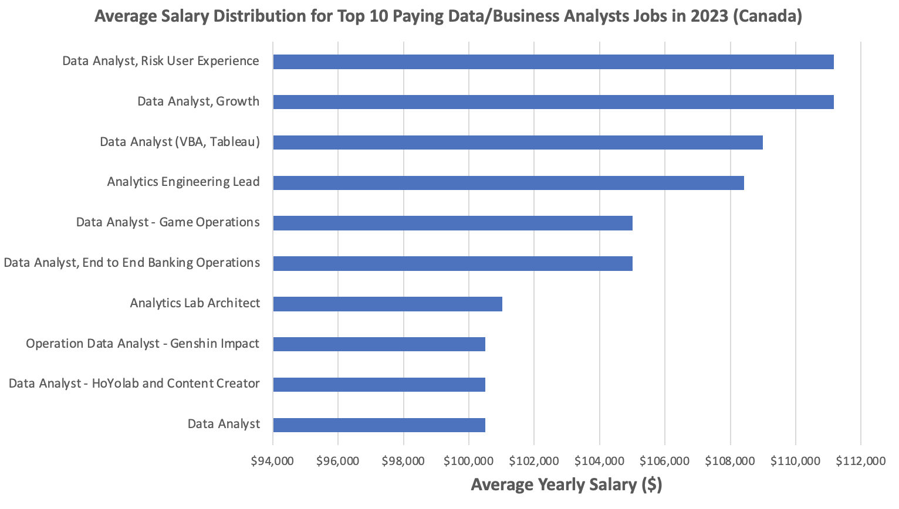
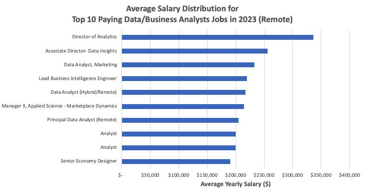
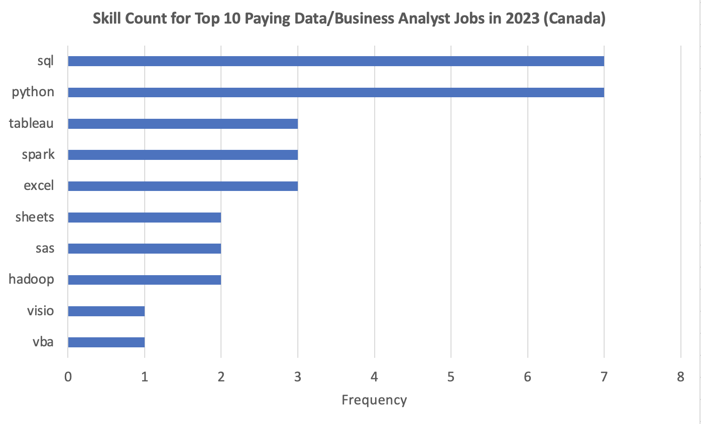
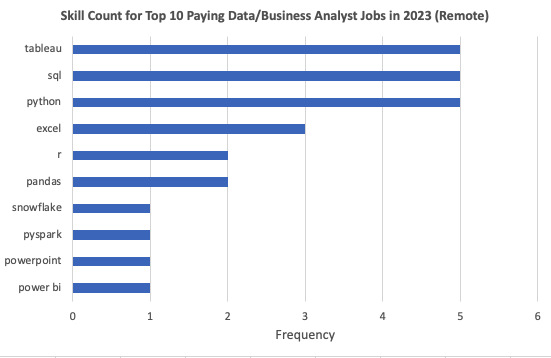

# Introduction
Welcome to my SQL portfolio project, where I dive into the data-related job market specifically focusing on 'data analyst' and 'business analyst' roles. In this project, I've identified the top-paying jobs, most in-demand skills, and jobs that are both high in demand and pays well in the data analytics field.  

Take a look at my SQL queries here: [project_sql folder](/project_sql/)

# Background
As someone looking to change his career into data analytics, what better way to make use of newly learned SQL skills than to look at the job market? I only knew what were the top skills demanded in the job market (e.g. SQL, Python, etc.) but didn't know much about who are hiring nor the compensation for those roles. I plan to use the findings of this project to make my job search more effective and informed.

The data for this analysis is from [Luke Barousse's SQL Course](https://www.youtube.com/watch?v=7mz73uXD9DA&t=14342s&ab_channel=LukeBarousse). This data includes details on job titles, salaries, locations, and required skills on data-related jobs posted in 2023 around the world.

The questions I aimed to answer through my SQL queries were: 

1. What are the data analyst/business analyst jobs that pay the most?
2. For those top-paying jobs, what data analytics skills are required?
3. Which skills are mentioned most for data analysts/business analysts roles?
4. Which skills are paid most for data analysts/business analysts roles? 
5. If I want to maximize my job market value (e.g, having the in-demand skills and high-paying salary), what are the most optimal skills to learn?

# Tools I used
For my analysis, I used a variety of tools:

* **PostgreSQL**: This relational database management system allowed me to store, query, and manipulate the data

* **VS Code (Visual Studio Code)**: This open-source code editor helped me manage the database and execute SQL queries.

* **Git & GitHub**: For version control and sharing my SQL queries and analysis online

# Analysis

### 1. Top-paying data analyst/business analyst jobs (Top 10)
To identify the top-paying roles, I filtered 'data analyst' and 'business analyst' roles by location, focusing on jobs in Canada. Then I sorted the results by average yearly salary. 

Query below highlights the top 10 highest paying jobs in the field.  

```sql
SELECT 
    job_id,
    job_title_short,
    job_title,
    job_location,
    job_schedule_type,
    company_dim.name AS company_name,
    salary_year_avg,
    job_posted_date
FROM
    job_postings_fact
LEFT JOIN company_dim ON job_postings_fact.company_id = company_dim.company_id
WHERE
    job_title_short IN ('Data Analyst', 'Business Analyst')
    AND job_location ILIKE '%Canada%'
    AND salary_year_avg IS NOT NULL
ORDER BY
    salary_year_avg DESC
LIMIT 10;

```

Using Excel, I created the charts below. First one shows the top paying jobs for data/business analyst roles in Canada and the second one shows the ones for remote jobs. 




Here's the breakdown of the top-paying data/business analyst jobs in 2023 (Canada):

* **Low salary upside in Canada**: Top 10 paying analyst roles in Canada span from $100,500 to $111,175 while those for remote jobs span from $190,000 to $336,500 indicating significant discrepancy in potential earnings within Canada. This could indicate the lack of senior roles or managerial roles in Canada. 

* **Limited industries**: Financial services companies (like Stripe and ATB Financial) and insurance companies (like Sun Life and Swiss Re) made up 70% of the list showing a concentrated distribution of specific industries. In contrast, for remote jobs, the industries were more diverse ranging from social media (Meta, Pinterest) and telecommunications (AT&T), to transport (Uber), etc.

* **Lack of high-paying business analyst roles**: Among the Top 10 list, there was no business analyst position mentioned in Canada. To compare, 5 out of 10 jobs were business analyst position in remote jobs.

### 2. Skills needed for those top-paying roles
To identify what skills are needed for the top-paying roles, I turned the previous query into a CTE in order to join it with the skills-related tables. 

Query below highlights the skills needed for the top-paying roles.  

```sql
-- CTE to get the top 10 highest-paying Data/Business Analyst jobs
WITH top_paying_jobs AS (
    SELECT 
        job_id,
        job_title_short,
        job_title,
        company_dim.name AS company_name,
        job_location,
        salary_year_avg
    FROM
        job_postings_fact
    LEFT JOIN company_dim ON job_postings_fact.company_id = company_dim.company_id
    WHERE
        job_title_short IN ('Data Analyst', 'Business Analyst')
        AND job_location ILIKE '%Canada%' --To get the results for remote jobs, I replaced this line with AND job_location = 'Anywhere'
        AND salary_year_avg IS NOT NULL
    ORDER BY
        salary_year_avg DESC
    LIMIT 10
)

SELECT 
    top_paying_jobs.*,
    skills_dim.skills
FROM top_paying_jobs
INNER JOIN skills_job_dim ON top_paying_jobs.job_id = skills_job_dim.job_id
INNER JOIN skills_dim ON skills_job_dim.skill_id = skills_dim.skill_id
ORDER BY
    salary_year_avg DESC

```

Using Excel, I created the charts below. First one shows the top paying skills for data/business analyst jobs in Canada and the second one shows the ones for remote jobs. 




SQL, Python, Tableau, Excel made to the top 5 skills that were most requested among the top-paying jobs both in Canada and for remote jobs. 

### 3. Most in-demand skills
The query below helped identify the skills most frequently requested in job postings. 

```sql
SELECT 
    skills,
    COUNT(skills_job_dim.job_id) AS demand_count
FROM job_postings_fact
INNER JOIN skills_job_dim ON job_postings_fact.job_id = skills_job_dim.job_id
INNER JOIN skills_dim ON skills_job_dim.skill_id = skills_dim.skill_id
WHERE  
    job_title_short IN ('Data Analyst', 'Business Analyst') AND job_location ILIKE '%Canada%'
GROUP BY   
    skills
ORDER BY   
    demand_count DESC
LIMIT 5

```
Here's the breakdown of the most in-demand skills for data/business analyst jobs in 2023:

* The top 5 in-demand skills were consistent across Canadian job markets and remote works. In addition, this list remains pretty much consistent with the highest-paying skills analyzed previously. 

* **SQL** and **Excel** topped the list for data processing and spreadsheet manipulation tools, emphasizing the importance of these fundamental tools.

* **Python** topped the list for programming tools.

* **Tableau** were preferred slightly more than **Power BI** as the most-wanted data visualization skills.

| Skill | Demand Count |
|---|---|
| sql | 1324 |
| excel | 977 |
| python | 777 |
| tableau | 608 |
| power bi | 603 |

*Table of the demand for the top 5 skills in data/business analyst job postings in Canada*

| Skill | Demand Count |
|---|---|
| sql | 8557 |
| excel | 5594 |
| python | 4876 |
| tableau | 4473 |
| power bi | 3164 |

*Table of the demand for the top 5 skills in data/business analyst job postings that allow remote work*

### 4. Top-paying skills
The query below helped identify the skills associated with the highest average annual salary. 

```sql
SELECT 
    skills,
    ROUND(AVG(salary_year_avg), 0) AS avg_salary
FROM job_postings_fact
INNER JOIN skills_job_dim ON job_postings_fact.job_id = skills_job_dim.job_id
INNER JOIN skills_dim ON skills_job_dim.skill_id = skills_dim.skill_id
WHERE  
    job_title_short IN ('Data Analyst', 'Business Analyst')
    AND salary_year_avg IS NOT NULL
    AND job_location ILIKE '%Canada%'
GROUP BY   
    skills
ORDER BY   
   avg_salary DESC
LIMIT 10

```

| Skill | Average Salary ($) |
|---|---|
| typescript | 108,416 |
| spark | 107,479 |
| hadoop | 107,167 |
| bigquery | 101,750 |
| javascript | 101,750 |
| databricks | 101,014 |
| sheets | 100,625 |
| jira | 100,500 |
| visio | 100,500 |
| looker | 100,500 |

*Table of the average salary for the top 10 paying skills for data/business analysts in Canada*

| Skill | Average Salary ($) |
|---|---|
| pyspark | 208,172 |
| bitbucket | 189,155 |
| couchbase | 160,515 |
| watson | 160,515 |
| datarobot | 155,486 |
| gitlab | 154,500 |
| swift | 153,750 |
| jupyter | 152,777 |
| chef | 152,500
| pandas | 151,821 |

*Table of the average salary for the top 10 paying skills for data/business analysts working remotely*

Here are some key insights: 

* **Big Data & Scripting Remain Valuable**: Both tables show strong demand for big data skills (Spark, Hadoop, BigQuery) and scripting languages (Javascript, Typescript).

* **Domain Expertise Might Differ**: The complete absence of skills like Couchbase, Watson, and Datarobot (prominent in Table 2) from Table 1 suggests these skills might be more valuable for specific industries or project types. Remote work might see a higher demand for specialized skills compared to on-site data/business analyst roles.

* **Focus May Shift from Traditional Tools**: While traditional tools like Sheets and Jira appear in Table 1, they're absent from the top remote roles (Table 2). This suggests a potential shift towards more specialized tools for remote data analysts.

### 5. Optimal skills to learn

The query below combined insights on in-demand skills and salary data to reveal the optimal skills to pursue to meet the market demand while getting paid well. Under the HAVING clause, I've added a logic to ensure we are filtering the most wanted skills.

```sql
SELECT
    skills_dim.skills,
    COUNT(skills_job_dim.job_id) AS demand_count,
    ROUND(AVG(job_postings_fact.salary_year_avg), 0) AS avg_salary
FROM job_postings_fact
INNER JOIN skills_job_dim ON job_postings_fact.job_id = skills_job_dim.job_id
INNER JOIN skills_dim ON skills_job_dim.skill_id = skills_dim.skill_id
WHERE
    job_title_short IN ('Data Analyst', 'Business Analyst')
    AND salary_year_avg IS NOT NULL
    AND job_location ILIKE '%Canada%'
GROUP BY
    skills_dim.skills
HAVING
    COUNT(skills_job_dim.job_id) > 5
ORDER BY
    avg_salary DESC,
    demand_count DESC
LIMIT 10

```

| Skills | Demand Count | Average Salary ($) |
|---|---|---|
| tableau | 9 | 92,572 |
| python | 15 | 92,328 |
| sas | 8 | 88,750 |
| sql | 19 | 87,193 |
| excel | 9 | 83,563 |
| power bi | 6 | 73,100 |

*Table of the most optimal skills for data/business analyst roles in Canada sorted by highest salary*

| Skills     | Demand Count | Average Salary ($) |
|------------|--------------|----------------|
| databricks | 11           | 139,006       |
| snowflake  | 38           | 112,989       |
| hadoop     | 25           | 111,849       |
| go         | 30           | 111,121       |
| bigquery   | 16           | 110,813       |
| azure      | 35           | 110,804       |
| confluence | 14           | 108,415       |
| aws        | 32           | 108,317       |
| ssis       | 12           | 106,683       |
| looker     | 54           | 106,259       |

*Table of the most optimal skills for data/business analyst (remote roles) sorted by highest salary*

Here are key insights:

* **General vs. Specific Skills**: General skills like Excel and Power BI have lower average salaries ($83,563 and $73,100) compared to more specialized skills like Databricks and Snowflake. This underscores the trend that generalist skills, while important, do not command as high a salary as specialized, high-demand technologies.

* **Entry-Level Skills with Moderate Salaries**: Skills such as SQL and Excel, while essential and having moderate demand (19 and 9 respectively), offer lower average salaries ($87,193 and $83,563). These skills are often fundamental but might not command the same premium as more specialized technologies like Databricks and Snowflake.

* **Demand-Salary Correlation**: While there is a correlation between demand and salary for some skills, it's not always direct. For instance, Snowflake and Azure have high demand and relatively high salaries, whereas Looker has the highest demand but a comparatively lower salary. This indicates that while demand influences salary, other factors like skill complexity and market saturation also play crucial roles.

# What I learned

* **Practical SQL Skills** 💡: Throughout this project, I developed a strong foundation in SQL, enhancing my ability to write and optimize queries effectively. I learned how to manage databases and handle large datasets efficiently. Mastering specific functions and techniques, such as JOIN operations, subqueries, and aggregate functions, significantly improved my proficiency in SQL.

* **Data Analysis and Insights Generation** 📊: This project taught me how to interpret data and generate meaningful insights. I learned how to analyze data trends, draw correlations, and identify key patterns that will inform my job-search process. Understanding the importance of using data to drive decisions has deepened my appreciation for the role of data/business analysts.

* **Troubleshooting and Debugging** 🛠️: I developed skills in troubleshooting and debugging SQL queries. Learning to identify and resolve issues such as syntax errors and logical errors was a key learning from this project.

# Conclusions

## Insights

1. **Specialization Pays Off**: Skills like Databricks and Snowflake command higher salaries than generalist tools like Excel and Power BI, emphasizing the value of specialized expertise.

2. **Complexity and Demand Impact Salaries**: While high demand generally correlates with higher salaries, factors like skill complexity and market saturation also influence pay scales, as seen with Snowflake and Azure versus Looker.

3. **Critical Skills Remain**: Big data technologies (e.g., Spark, Hadoop) and scripting languages (e.g., Python) continue to be crucial for data analysts, reflecting ongoing industry needs for data processing and automation.

4. **Industry-Specific Demand**: Remote roles prioritize specialized tools like Couchbase and Watson, indicating industry-specific preferences influenced by remote work dynamics.

5. **Shift to Specialized Remote Tools**: Remote data analyst roles favor specialized tools over traditional ones like Sheets and Jira, highlighting a trend towards tools that support advanced data analysis and visualization.